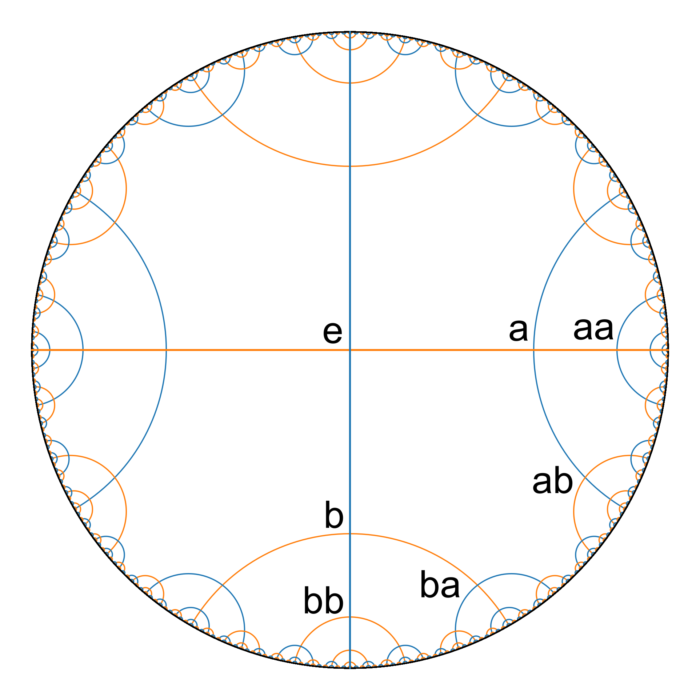
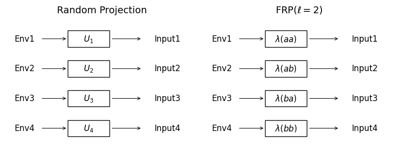

# Free Random Projection for In-Context Reinforcement Learning

This repository implements  [**Free Random Projection (FRP)**](https://arxiv.org/abs/2504.06983), a technique for meta/in-context reinforcement learning that uses orthogonal matrix transformations to create diverse task variations while preserving inner products, enabling effective in-context adaptation across environments.

<div>


<div style="clear: both;"></div>
</div>

## Overview

Free Random Projection enables agents to:
- Adapt to new task variations during evaluation without parameter updates (in-context learning)
- Learn robust representations through orthogonal transformations
- Perform meta-learning across diverse partially observable environments

### Key Components

1. **frp_popjaxrl/**: Core FRP implementation with JAX-based meta-RL algorithms
2. **lsmdp/**: Linearly Solvable MDP experiments with analytical solutions
3. **spectrum/**: Spectral analysis tools for FRP matrix properties

## Quick Start

### Installation
```bash
# Install dependencies
uv sync
```

### Run FRP Meta-RL Experiment
```bash
cd frp_popjaxrl
python run_meta_popgym.py --arch s5 --depth 2 --dim 32 --env cartpole --max_depth 8
```

### Run LS-MDP Experiments
```bash
cd lsmdp
python main.py                           # Basic demonstration
python policy_aggregation_experiment.py # Policy aggregation research
```

### Run Spectral Analysis
```bash
cd spectrum
python eigs_multi_average.py --d 64 --t 128 --c 1
```

## Project Structure

- **frp_popjaxrl/**: Main FRP implementation ([details](frp_popjaxrl/README.md))
  - Core FRP algorithm using orthogonal matrix composition
  - PPO with S5/GRU architectures for in-context learning
  - Meta-environment framework extending PopJaxRL
  
- **lsmdp/**: Linearly Solvable MDPs ([details](lsmdp/README.md))
  - Analytical solutions for optimal policies and value functions
  - Policy aggregation experiments
  - Support for lattice and tree state spaces
  
- **spectrum/**: Spectral analysis ([details](spectrum/README.md))
  - Eigenvalue distribution analysis of FRP matrices
  - Comparison with theoretical predictions (Wigner quarter-circle law)
  - Effective dimension computations


# Citation
FRP
```
@article{hayase2025free,
  title={Free Random Projection for In-Context Reinforcement Learning},
  author={Hayase, Tomohiro and Collins, Beno{\^\i}t and Inoue, Nakamasa},
  journal={arXiv preprint arXiv:2504.06983},
  year={2025}
}
```
# References and Acknowledgments

The code implementations of frp_popjaxrl are heavily inspired by:

- [popjaxrl](https://github.com/luchris429/popjaxrl)
- [POPGym](https://github.com/proroklab/popgym)
- [S5](https://github.com/lindermanlab/S5/tree/main)
- [Gymnax](https://github.com/RobertTLange/gymnax)
- [PureJaxRL](https://github.com/luchris429/purejaxrl/tree/main)

If you use the relevant components from above, please also cite them. This includes:

PopJaxRL
```
@article{lu2023structured,
  title={Structured State Space Models for In-Context Reinforcement Learning},
  author={Lu, Chris and Schroecker, Yannick and Gu, Albert and Parisotto, Emilio and Foerster, Jakob and Singh, Satinder and Behbahani, Feryal},
  journal={arXiv preprint arXiv:2303.03982},
  year={2023}
}
```

S5
```
@inproceedings{
smith2023simplified,
title={Simplified State Space Layers for Sequence Modeling},
author={Jimmy T.H. Smith and Andrew Warrington and Scott Linderman},
booktitle={The Eleventh International Conference on Learning Representations },
year={2023},
url={https://openreview.net/forum?id=Ai8Hw3AXqks}
}
```

POPGym
```
@inproceedings{
morad2023popgym,
title={{POPG}ym: Benchmarking Partially Observable Reinforcement Learning},
author={Steven Morad and Ryan Kortvelesy and Matteo Bettini and Stephan Liwicki and Amanda Prorok},
booktitle={The Eleventh International Conference on Learning Representations},
year={2023},
url={https://openreview.net/forum?id=chDrutUTs0K}
}
```

Gymnax
```
@software{gymnax2022github,
  author = {Robert Tjarko Lange},
  title = {{gymnax}: A {JAX}-based Reinforcement Learning Environment Library},
  url = {http://github.com/RobertTLange/gymnax},
  version = {0.0.4},
  year = {2022},
}
```

PureJaxRL
```
@article{lu2022discovered,
    title={Discovered policy optimisation},
    author={Lu, Chris and Kuba, Jakub and Letcher, Alistair and Metz, Luke and Schroeder de Witt, Christian and Foerster, Jakob},
    journal={Advances in Neural Information Processing Systems},
    volume={35},
    pages={16455--16468},
    year={2022}
}
```
